```mermaid
sequenceDiagram
  autonumber
  participant 🙋 Requestor
  participant ✅ Approver
  participant 🖥️ System
  participant 🛒 Purchasing

  Note over 🙋 Requestor,🖥️ System: ▶️ PR Process Starts

  🙋 Requestor->>🖥️ System: 📝 Submit PR
  activate 🖥️ System
  🖥️ System-->>🖥️ System: 🏷️ Emit **PRCreated**
  🖥️ System-->>✅ Approver: 🔔 Notify Approvers
  deactivate 🖥️ System

  alt ✅ All Approvers Approve
    ✅ Approver->>🖥️ System: ✔️ Approve PR
    activate 🖥️ System
    🖥️ System-->>🖥️ System: 🏷️ Emit **PRApproved**
    🖥️ System-->>🛒 Purchasing: 📢 Notify Purchasing
    deactivate 🖥️ System
  else ❌ Any Approver Rejects
    ✅ Approver->>🖥️ System: ❌ Reject PR
    activate 🖥️ System
    🖥️ System-->>🖥️ System: 🏷️ Emit **PRRejected**
    🖥️ System-->>🙋 Requestor: 🔄 Return PR for revision
    deactivate 🖥️ System
    🙋 Requestor->>🖥️ System: ✏️ Revise PR
    🖥️ System-->>🖥️ System: 🏷️ Emit **PRRevised**
  end
```

```mermaid
sequenceDiagram
  autonumber
  participant 🛒 Purchasing
  participant ✅ Approver
  participant 🧾 Supplier
  participant 🏢 Warehouse
  participant 🖥️ System

  Note over 🛒 Purchasing,🖥️ System: ▶️ PO Lifecycle

  🛒 Purchasing->>🖥️ System: 📝 Create PO from Approved PR
  activate 🖥️ System
  🖥️ System-->>🖥️ System: 🏷️ Emit **POCreated**
  deactivate 🖥️ System

  🛒 Purchasing->>🖥️ System: 🛠️ Finalize PO
  🖥️ System-->>🖥️ System: 🏷️ Emit **POFinalized**

  ✅ Approver->>🖥️ System: ✔️ Approve PO
  activate 🖥️ System
  🖥️ System-->>🖥️ System: 🏷️ Emit **POApproved**
  🖥️ System-->>🧾 Supplier: 📩 Notify Supplier of PO
  🖥️ System-->>🖥️ System: 🏷️ Emit **POSentToSupplier**
  deactivate 🖥️ System

  alt 🚚 Supplier delivers items
    🧾 Supplier->>🏢 Warehouse: 📦 Deliver Items
    🏢 Warehouse->>🖥️ System: ✅ Confirm Delivery
    activate 🖥️ System
    🖥️ System-->>🖥️ System: 🏷️ Emit **ItemDelivered**
    🖥️ System-->>🖥️ System: 🔄 Auto-Close PO if all items received
    🖥️ System-->>🖥️ System: 🏷️ Emit **POClosed**
    🖥️ System-->>🖥️ System: 🏷️ Emit **LinkedPRItemsClosed**
    deactivate 🖥️ System
  else 🚫 PO Cancelled before delivery
    🛒 Purchasing->>🖥️ System: ❌ Cancel PO (with reason)
    🖥️ System-->>🖥️ System: 🏷️ Emit **POCancelled**
  end
```

```mermaid
sequenceDiagram
  autonumber
  participant 👤 User
  participant 🖥️ System

  Note over 👤 User,🖥️ System: ▶️ New Supply Item Entry

  👤 User->>🖥️ System: ➕ Add New Supply Item
  🖥️ System-->>🖥️ System: 🏷️ Emit **SupplyItemCreated**
  🖥️ System-->>🖥️ System: 🆔 Auto-Assign Internal Item ID
  🖥️ System-->>🖥️ System: 🏷️ Emit **SupplyItemIDAssigned**

  Note over 🖥️ System: 🔄 Syncing & Indexing
  🖥️ System-->>🖥️ System: 🔍 Sync to Search Index/API Layer
  🖥️ System-->>🖥️ System: 🏷️ Emit **SupplyItemIndexed**
```

```mermaid
sequenceDiagram
  autonumber
  participant 👤 User
  participant 🧑‍💼 Admin
  participant 🖥️ System

  Note over 👤 User,🖥️ System: ▶️ New Supplier Onboarding

  👤 User->>🖥️ System: 📩 Submit New Supplier
  🖥️ System-->>🖥️ System: 🏷️ Emit **SupplierCreated**
  🖥️ System-->>🧑‍💼 Admin: 🔔 Notify Admins for Review

  alt ✅ Approved
    🧑‍💼 Admin->>🖥️ System: 🆗 Approve Supplier
    🖥️ System-->>🖥️ System: 🏷️ Emit **SupplierApproved**
  else 🚫 Rejected
    🧑‍💼 Admin->>🖥️ System: ❌ Reject Supplier
    🖥️ System-->>🖥️ System: 🏷️ Emit **SupplierRejected**
    👤 User->>🖥️ System: ✏️ Revise Supplier Details
    🖥️ System-->>🖥️ System: 🏷️ Emit **SupplierRevised**
  end

  alt 🚷 Blacklisted
    🧑‍💼 Admin->>🖥️ System: ⚠️ Mark as Non-Compliant
    🖥️ System-->>🖥️ System: 🏷️ Emit **SupplierBlacklisted**
  end

  alt 🗃️ Archived
    🧑‍💼 Admin->>🖥️ System: 🗑️ Archive Inactive Supplier
    🖥️ System-->>🖥️ System: 🏷️ Emit **SupplierArchived**
  end
```

- Table of Contents

# 🗂️ 1. High Level Overview

## :project: 1.1 **Project Introduction**

The **JBC Purchasing System** is a full-stack application developed to digitize and optimize the company's procurement workflow. It replaces the existing manual process—which is prone to inefficiencies, limited traceability, and redundancy in managing **Purchase Requests (PRs)** and **Purchase Orders (POs)**.

Currently, each step—from identifying procurement needs and securing approvals to issuing purchase orders and revalidating them—is performed manually. This results in several operational issues:

- Poor document traceability throughout the project lifecycle.
- High risk of duplicate PRs and POs due to the lack of a centralized tracking system.
- Dependence on paper-based records, making document retrieval and audit processes time-consuming.

The JBC Purchasing System addresses these challenges by automating the end-to-end procurement process. It enables real-time tracking of PRs and POs, ensures approval workflows are streamlined, and minimizes human error. Furthermore, it incorporates a comprehensive Supplier and Supply Database that centralizes historical procurement data, including supplier profiles, pricing history, and past transactions.

---

## 1.2 System Interaction Overview

```mermaid
sequenceDiagram
    autonumber
    participant 🙋 Requestor
    participant 🏢 Warehouse
    participant ✅ Approver
    participant 🛒 Purchasing
    participant 🧾 Supplier

    %% 📌 PR CREATION
    🙋 Requestor->>🙋 Requestor: 📋 Select Project & Items
    🙋 Requestor->>🙋 Requestor: 🏷️ Choose Preferred Supplier(s)
    🙋 Requestor->>🏢 Warehouse: 🔍 Check Available Stock
    🏢 Warehouse-->>🙋 Requestor: 📦 Relay Stock Info

    🙋 Requestor->>✅ Approver: 📤 Submit PR
    ✅ Approver->>✅ Approver: 👀 Review PR
    ✅ Approver-->>🙋 Requestor: 💬 Feedback / Comments (if needed)

    alt ✅ PR Approved
        ✅ Approver-->>🙋 Requestor: ✅ PR Approved
    else ❌ PR Rejected
        ✅ Approver-->>🙋 Requestor: ❌ PR Rejected
        🙋 Requestor->>🙋 Requestor: ✏️ Revise and Resubmit PR
        🙋 Requestor->>✅ Approver: 📤 Submit Revised PR
    end

    %% 📝 PO CREATION
    🙋 Requestor->>🛒 Purchasing: 📢 Notify Purchasing of Approved PR
    🛒 Purchasing->>🛒 Purchasing: 🧾 Generate PO from PR
    🛒 Purchasing->>🛒 Purchasing: 🛠️ Finalize PO Details (Items, Terms, Pricing)
    🛒 Purchasing->>✅ Approver: 📤 Submit PO for Approval
    ✅ Approver->>✅ Approver: 🔍 Review PO
    ✅ Approver-->>🛒 Purchasing: ✅ PO Approved

    %% 🚚 SUPPLIER PROCESS
    🛒 Purchasing->>🧾 Supplier: 📩 Send PO
    🧾 Supplier-->>🛒 Purchasing: 📥 Acknowledge Receipt
    🧾 Supplier->>🏢 Warehouse: 📦 Deliver Items

    %% 📦 RECEIVING & CLOSURE
    🏢 Warehouse->>🏢 Warehouse: 🔍 Inspect & Confirm Delivery
    🏢 Warehouse-->>🛒 Purchasing: ✅ Confirm Items Received
    🛒 Purchasing->>🛒 Purchasing: 🗂️ Close PO
    🛒 Purchasing-->>🙋 Requestor: 📬 Notify Items Delivered & PO Closed
```



## **🔍 1.3 Problems Addressed**

- **Manual and Inefficient Processing** – Eliminates manual handling of **Purchase Requests (PRs)** and **Purchase Orders (POs)** by automating creation, approval, and tracking.
- **Lack of Procurement Visibility** – Establishes systematic tracking of all project-related purchases for improved documentation and traceability.
- **Disconnected PR and PO Workflows** – Seamlessly links PRs to corresponding POs to enhance accountability and process integrity.
- **Approval Bottlenecks** – Introduces an **online approval workflow** to reduce delays and streamline decision-making.
- **Fragmented Supplier and Inventory Data** – Creates a centralized, organized database for efficient supplier and inventory management.
- **Redundant Inquiries on Past Orders** – Enables instant access to historical transactions, minimizing repetitive questions about previously purchased items or prices.

---

## **✅ 1.4 System Goals**

1. **Automate the Procurement Lifecycle** – Streamline PR and PO processing to boost efficiency, reduce manual errors, and ensure consistency.
2. **Enhance Procurement Transparency** – Systematically log and track all procurement activities to support auditability and accountability.
3. **Centralize Supplier and Material Records** – Consolidate supplier details, material specifications, and pricing history into a unified repository.
4. **Accelerate Approval Processes** – Implement an online approval mechanism to reduce turnaround time and improve responsiveness.
5. **Reduce Operational Redundancy** – Prevent duplicate orders and repeated supplier inquiries by enabling access to comprehensive procurement history.
6. **Enforce Compliance and Control** – Maintain adherence to internal policies and procurement standards through structured workflows and validations.

---

## **🎯 1.5 Key Objectives**

1. **Digitize End-to-End Procurement Workflow** – Develop a robust system covering PR initiation, PO issuance, and multi-level approvals.
2. **Establish a Supplier and Inventory Database** – Build a well-structured repository for managing supplier profiles, transaction records, and item pricing.
3. **Enable PR-PO Relationship Mapping** – Ensure that each PR is directly associated with its corresponding PO for enhanced traceability and reporting.
4. **Implement Online Approvals with Notifications** – Integrate real-time email and in-app notifications to facilitate timely actions and updates.
5. **Provide Advanced Search and Reporting Tools** – Equip the system with powerful filters, queries, and reporting features for procurement analysis.
6. **Enforce Role-Based Access Control (RBAC)** – Define user roles and permissions to secure sensitive actions and data access.
7. **Optimize for Usability** – Design a user-friendly interface that simplifies navigation and reduces onboarding time for end-users.
8. **Ensure Scalability and System Integration** – Architect the platform for growth and compatibility with future enterprise systems.

---

## **🎯 1.6 Scope**

### **✅ 1.6.1 In-Scope Deliverables**

- **Development of a Web-Based Full-Stack Purchasing System**, including:
    - Automated creation, tracking, and approval workflows for **Purchase Requests (PRs)** and **Purchase Orders (POs)**.
- **Centralized Database Implementation** to manage:
    - Purchase Requests and Purchase Orders
    - Project Codes for procurement linkage
    - Supplier information (e.g., contact details, payment terms)
    - Historical purchasing data (item, price, quantity, supplier)
    - Inventory status integration for availability checks
- **Online Approval System Integration** with:
    - Real-time notifications and dashboard-based approval management
    - Integration with email and Discord bots for alerts and status updates
- **Role-Based Access Control (RBAC)** with defined permissions for key user roles:
    - Purchasing, Warehouse, General Manager (GM), and Requestors
- **Advanced Reporting and Analytics Tools** for:
    - Procurement audits, pricing comparisons, and insights
- **User-Centric Interface Design** to enhance usability, featuring:
    - Dashboards to visualize procurement status
    - Fast retrieval of procurement records
    - Searchable supplier and supply listings with tags and keyword filters
- **System Deployment** within the organization's on-premise or cloud infrastructure, as per company preference
- **Comprehensive Documentation and Training**:
    - User manuals, onboarding materials, and support guides
- **Post-Deployment Operational Support** for maintenance and issue resolution

### **🚫 1.6.2 Out-of-Scope Items**

- Full accounting or financial modules (e.g., invoicing, payment tracking)
- Comprehensive inventory management beyond procurement-related availability checking
- Supplier lifecycle management beyond basic data storage and retrieval
- Mobile application development (unless separately scoped)
- Migration of legacy or third-party system data (unless explicitly included in a separate project phase)

---

## **📈 1.7 Success Metrics**

### **📌 1.7.1 Key Performance Indicators (KPIs)**

- **Processing Time Reduction**
    - Target: Reduce average PR/PO processing time by 60%
- **Approval Cycle Efficiency**
    - Target: Decrease average approval time from 4 hours to 30 minutes
- **Duplicate Order Minimization**
    - Target: Near-zero duplicate PO incidents per month
- **Accuracy and Compliance**
    - Target: Achieve 95%+ accuracy rate in documentation and workflow execution
- **System Adoption Rate**
    - Target: 100% of purchasing activities performed via the system within 3–6 months of rollout
- **User Satisfaction**
    - Target: Minimum 85% satisfaction score based on user surveys and feedback

### **📌 1.7.2 Project Milestones**

- Completion of Core Modules:
    - User, Supplier, Supplies, PR, PO, and Administrator Modules
    - Price Comparison, Analytics, and Auditing features
- Completion of User Acceptance Testing (UAT) with <5 critical issues
- Successful system deployment within agreed timeline and budget
- Completion of training and onboarding sessions for all end-users
- Realization of initial business value and ROI within 3–6 months post-launch

---

## 💪 1.8 Definition of Done

> To be fulfilled
> 

## **🔮 1.9 Future Enhancements**

- **Warehouse Module Integration**
    - Expand system capabilities to support real-time tracking of stock levels across warehouses and project sites

---

# **📘 2: Domain Model – What the system is about**

> Goal: Serve as the single source of truth for business concepts, relationships, states, rules, and system behavior.
> 

---

## **✅ Lean Structure (Recommended to Start)**

## **🧑‍🤝‍🧑 2.1 Key Actors**

> Markdown list or Mermaid diagram of key actor actions
> 
- **Requestor** – initiates purchase request (PR)
- **Approver** – reviews and approves PRs and POs
- **Purchasing Officer** – generates and finalizes Purchase Orders (POs)
- **Warehouse Staff** – confirms item delivery and closes POs
- **Supplier** – receives orders and delivers items

---

## **📝** 2.2 User Initiated Workflows (Manual process Flow)

> Example: Requestor → Approver → Purchasing → Warehouse
> 

> Focus: End-to-end flow of actions **initiated by human actors**
> 
> 
> Includes:
> 
> - Visual **user journey** for PR and PO creation
> - Color-coded actor responsibilities (Requestor, Approver, Purchasing, Supplier, Warehouse)
> - Helps identify manual pain points, bottlenecks, or UI flow decisions

### 🧾 2.2.1 PR Requestor Flow


### 📤 2.2.2 **PO Creation and Fulfillment Flow**


### 🧺 2.2.3 Supplies & Suppliers


---

## ⚙️ 2.3 System-Automated Processes (Event & System Flow)

> Focus: All **automated backend logic** and system responsibilities once a manual action is taken
> 
> 
> Includes:
> 
> - Notification triggers
> - State transitions
> - Event emissions
> - Automated status updates
> - Useful for Dev/Infra reference, debugging, or scaling event-driven architecture

### 📝 2.3.1 PR Automation Sequence


### 📦 2.3.2 PO Automation Sequence

```mermaid
flowchart LR
  E[📄 PO Created from Approved PR] --> F[✅ Upon PO Approval → Status: Approved]
  F --> G[📤 Notify Supplier]
  G --> H[📦 Upon Delivery Confirmation → Status: Delivered]
  H --> I[📁 PO Marked as Closed]
  I --> J[🔒 Linked PR Items Auto-Closed]
  J --> K[📡 Emit Events: PRApproved, POCreated, ItemDelivered]

  %% Styles
  style E fill:#4a5568,color:#ffffff,stroke:#4a5568,stroke-width:1px
  style F fill:#4a5568,color:#ffffff,stroke:#4a5568,stroke-width:1px
  style G fill:#4a5568,color:#ffffff,stroke:#4a5568,stroke-width:1px
  style H fill:#4a5568,color:#ffffff,stroke:#4a5568,stroke-width:1px
  style I fill:#4a5568,color:#ffffff,stroke:#4a5568,stroke-width:1px
  style J fill:#4a5568,color:#ffffff,stroke:#4a5568,stroke-width:1px
  style K fill:#4a5568,color:#ffffff,stroke:#4a5568,stroke-width:1px
```



### 🧾 2.3.3 Supplies & Suppliers - **System-Automated Processes**

```mermaid
flowchart LR
  A[🏢 New Supplier Submitted] --> B[📣 Trigger Notification to Approver]
  B --> C[✅ Upon Approval → Status: Active]
  C --> D[🪪 Log Audit Event: SupplierAdded]
  
  E[🧾 New Supply Item Saved] --> F[🆔 Auto-Assign Internal Item ID]
  F --> G[🪪 Log Audit Event: SupplyItemCreated]
  G --> H[🔄 Sync to Search Index / API Exposure Layer]

  %% Styles
  style A fill:#4a5568,color:#ffffff,stroke:#4a5568
  style B fill:#4a5568,color:#ffffff,stroke:#4a5568
  style C fill:#4a5568,color:#ffffff,stroke:#4a5568
  style D fill:#4a5568,color:#ffffff,stroke:#4a5568

  style E fill:#4a5568,color:#ffffff,stroke:#4a5568
  style F fill:#4a5568,color:#ffffff,stroke:#4a5568
  style G fill:#4a5568,color:#ffffff,stroke:#4a5568
  style H fill:#4a5568,color:#ffffff,stroke:#4a5568
```



## **2.4 State Machines**

> Table or Mermaid state diagrams for core entities (PR, PO, etc.)
Focus on states + allowed transitions
> 

### 2.4.1 PR States


### 2.4.2 PO States


### 2.4.3 Suppliers States


### 2.4.4 Supplies States


## **2.5 Domain Events**

> Focus: Emitted events that represent key transitions or actions within the system.
> 
> 
> These events are useful for:
> 
> - Logging & audit trails
> - Notifications & workflows
> - External integrations
> - Building event-driven pipelines

### **🧾 2.5.1 PR Events and Lifecycle**

**Table**

| **Event Name** | **Trigger Source** | **Payload Sample Fields** | **Notes** |
| --- | --- | --- | --- |
| PRCreated | On PR submission | prId, requestorId, projectCode, items | Used for notifying approvers |
| PRApproved | On final PR approval | prId, approvedBy, timestamp | Triggers PO generation logic |
| PRRejected | On any PR rejection | prId, rejectedBy, reason | Sends rejection notice |
| PRCancelled | When PR is cancelled | prId, cancelledBy, reason | Marks PR as inactive |
| PRRevised | After a rejected PR is edited | prId, revisedBy, newData | Re-enters approval workflow |

**JSON**

```json
{
  "PRCreated": {
    "source": "UserAction",
    "payload": ["prId", "requestorId", "projectCode", "items"]
  },
  "PRApproved": {
    "source": "System/ApproverAction",
    "payload": ["prId", "approvedBy", "timestamp"]
  },
  "PRRejected": {
    "source": "ApproverAction",
    "payload": ["prId", "rejectedBy", "reason"]
  },
  "PRCancelled": {
    "source": "UserAction",
    "payload": ["prId", "cancelledBy", "reason"]
  },
  "PRRevised": {
    "source": "UserAction",
    "payload": ["prId", "revisedBy", "newData"]
  }
}
```

**Lifecycle**



---

### **📤 2.5.2 PO Events & Lifecycle**

| **Event Name** | **Trigger Source** | **Payload Sample Fields** | **Notes** |
| --- | --- | --- | --- |
| POCreated | On PO draft creation | poId, linkedPrId, createdBy, lineItems | For tracking linked PR conversion |
| POFinalized | When PO is finalized | poId, finalizedBy, deliveryTerms, notes | Could trigger pre-approval hooks |
| POApproved | On PO approval | poId, approvedBy, timestamp | Sends to supplier automatically |
| POCancelled | On PO cancellation | poId, cancelledBy, reason | Reverses downstream expectations |
| POSentToSupplier | When PO is emailed/dispatched | poId, supplierId, dispatchMethod | Important for audit trails |
| ItemDelivered | Upon warehouse confirmation | poId, receivedBy, items, deliveryDate | Marks delivery success |
| POClosed | Final confirmation of delivery | poId, closedBy, timestamp | Closes related workflows |

```json
{
  "POCreated": {
    "source": "PurchasingAction",
    "payload": ["poId", "linkedPrId", "createdBy", "lineItems"]
  },
  "POFinalized": {
    "source": "PurchasingAction",
    "payload": ["poId", "finalizedBy", "deliveryTerms", "notes"]
  },
  "POApproved": {
    "source": "ApproverAction",
    "payload": ["poId", "approvedBy", "timestamp"]
  },
  "POCancelled": {
    "source": "Manual/System",
    "payload": ["poId", "cancelledBy", "reason"]
  },
  "POSentToSupplier": {
    "source": "SystemAction",
    "payload": ["poId", "supplierId", "dispatchMethod"]
  },
  "ItemDelivered": {
    "source": "WarehouseAction",
    "payload": ["poId", "receivedBy", "items", "deliveryDate"]
  },
  "POClosed": {
    "source": "PurchasingAction",
    "payload": ["poId", "closedBy", "timestamp"]
  }
}
```



---

### **🧺 2.5.3 Supplies Events**

**Table**

| **Event Name** | **Trigger Source** | **Payload Sample Fields** | **Notes** |
| --- | --- | --- | --- |
| SupplyItemCreated | On adding new supply | supplyId, itemCode, addedBy | Updates index/search |
| SupplyItemUpdated | On editing item details | supplyId, updatedBy, newFields | Sync with catalog |
| SupplyItemArchived | On archiving/deleting item | supplyId, archivedBy, reason | Not removed, just hidden |

**JSON**

```json
{
  "SupplyItemCreated": {
    "source": "System",
    "payload": ["supplyId", "itemCode", "addedBy"]
  },
  "SupplyItemUpdated": {
    "source": "UserAction",
    "payload": ["supplyId", "updatedBy", "newFields"]
  },
  "SupplyItemArchived": {
    "source": "System/UserAction",
    "payload": ["supplyId", "archivedBy", "reason"]
  }
}
```

**Lifecycle**



---

### **🧑‍🏭 2.5.4 Supplier Events**

**Table**

| **Event Name** | **Trigger Source** | **Payload Sample Fields** | **Notes** |
| --- | --- | --- | --- |
| SupplierAdded | On submission + approval | supplierId, addedBy, details | Triggers onboarding workflows |
| SupplierApproved | After admin approval | supplierId, approvedBy, timestamp | Signals that supplier is active |
| SupplierRejected | If rejected during vetting | supplierId, rejectedBy, reason | Might allow revision |
| SupplierBlacklisted | On compliance failure | supplierId, flaggedBy, reason | Blocks from future POs |
| SupplierArchived | Marked inactive | supplierId, archivedBy, reason | Hidden but retained |

**JSON**

```json
{
  "SupplierAdded": {
    "source": "UserAction",
    "payload": ["supplierId", "addedBy", "details"]
  },
  "SupplierApproved": {
    "source": "AdminAction",
    "payload": ["supplierId", "approvedBy", "timestamp"]
  },
  "SupplierRejected": {
    "source": "AdminAction",
    "payload": ["supplierId", "rejectedBy", "reason"]
  },
  "SupplierBlacklisted": {
    "source": "AdminAction",
    "payload": ["supplierId", "flaggedBy", "reason"]
  },
  "SupplierArchived": {
    "source": "AdminAction",
    "payload": ["supplierId", "archivedBy", "reason"]
  }
}
```

**Lifecycle**



---

### **🧑‍🏭 2.5.5 User Management Events**

**Table**

| **Event Name** | **Trigger Source** | **Payload Sample Fields** | **Notes** |
| --- | --- | --- | --- |
| UserAdded | On user creation by admin | userID, email, createdBy, timestamp |  |
| UserUpdated | After admin modification of user details | userID, fieldsUpdated, editedBy, timestamp |  |
| UserPasswordChangeRequested | User requests to change password via system button | userID, rejectedBy, reason, timestamp | Might allow revision |
| SupplierBlacklisted | On compliance failure | supplierId, flaggedBy, reason | Blocks from future POs |
| SupplierArchived | Marked inactive | supplierId, archivedBy, reason | Hidden but retained |

**JSON**

```json
{
  "SupplierAdded": {
    "source": "UserAction",
    "payload": ["supplierId", "addedBy", "details"]
  },
  "SupplierApproved": {
    "source": "AdminAction",
    "payload": ["supplierId", "approvedBy", "timestamp"]
  },
  "SupplierRejected": {
    "source": "AdminAction",
    "payload": ["supplierId", "rejectedBy", "reason"]
  },
  "SupplierBlacklisted": {
    "source": "AdminAction",
    "payload": ["supplierId", "flaggedBy", "reason"]
  },
  "SupplierArchived": {
    "source": "AdminAction",
    "payload": ["supplierId", "archivedBy", "reason"]
  }
}
```

**Lifecycle**


---

## **2.6 Entity Schemas & Attributes**

> *Defines the actual data models per entity. Focuses on field names, data types, optionality, enums, validation rules.*
> 
- For each core domain (PR, PO, PR_ITEM, Supply, Supplier, User):
    - Tabular breakdown of fields
    - Brief notes per field (e.g., derived, required, optional)
    - Optional: constraints, examples, or indexing notes
    - Link to full schema file (if you maintain it in GitHub or Notion Code Blocks)

### 2.6.1 User Schema (`userModel`)

- **📦 Schema Definition**
    
    
    | **Property** | **Data Type** | **Notes** |
    | --- | --- | --- |
    | userID | string | Unique HR-defined identifier. Required and unique. Used as human-readable reference. |
    | fullname | string | Full name of the user. Required. |
    | email | string | Stored in lowercase. Required and unique. Used for login and notifications. |
    | password | string | Hashed with bcrypt before saving. Required. |
    | role | string | Enum from userRoleEnums. Defaults to defaultUserRole. Used in RBAC. |
    | position | string | Job position or title. Required. |
    | department | string | Department assignment. Required. |
    | status | string | Enum from userStatusEnums. Defaults to active. Indicates current system access state. |
- **🔍 Additional Details**
    - **🔑 Indexing**:
        - `userID` and `email` are both uniquely indexed to support high-performance lookup and enforce uniqueness constraints.
        - MongoDB's default `_id` is retained for internal relations and joins.
    - **🧠 Password Encryption**:
        - Uses a pre-save middleware hook to hash passwords with bcrypt.
        - Ensures that updates to the password field also trigger re-hashing.
    - **📚 Enumerations**:
        - `role`, `status`, `department`, and `position` reference predefined enums:
            
            ```jsx
            enum UserRoleEnum { requestor, approver, purchasing, admin }
            enum UserStatusEnum { active, inactive, archived }
            ```
            
    - **🕓 Timestamps**:
        - Enabled via timestamps: true, auto-generating `createdAt` and `updatedAt` fields.
    - **🧪 Example Index Setup**:
        
        ```jsx
        userSchema.index({ userID: 1 }, { unique: true });
        userSchema.index({ email: 1 }, { unique: true });
        ```
        
- **🔄 Suggested Usage**
    
    
    | **Use Case** | **Suggested Field** |
    | --- | --- |
    | Login & Auth | `email`, `password` |
    | RBAC/permissions | `role` |
    | Filtering by department/team | `department` |
    | Linking to PRs/POs | `userID` |
    | Audit logs / tracking | `userID` |

---

### **🧾** 2.6.2 Purchase Request Schema (`prModel`)

- **📦 Schema Definition**
    
    
    | **Property** | **Data Type** | **Notes** |
    | --- | --- | --- |
    | prID | string (**pk**) | Human-readable unique reference (e.g., PR-2024-001). Used as public identifier. |
    | projCode | string (**fk**) | Foreign key referencing the associated project. |
    | projName | string | Auto-filled from projCode. Optional display field. |
    | projClient | string | Auto-filled from projCode. Used for traceability. |
    | dateRequired | Date | Expected delivery or usage date of the requested items. |
    | requestedBy | string (**fk**) | References userID of the employee initiating the PR. |
    | recommendedBy | string (**fk**) | References userID of recommending approver. Optional. |
    | approvedBy | string (**fk**) | References userID of final approver (e.g., GM). |
    | prStatus | string | Enum: Draft, Submitted, Approved, Rejected, Cancelled. Controlled via workflow. |
    | itemsRequested | List[PR_ITEMS] (**fk**) | Linked PR item objects. Referenced externally for PO generation. |
    | totalCost | float | Computed from linked items (unitPrice × quantity). Not editable. |
    | justification | string | Business reasoning for the purchase request. Optional for basic items. |
- **📝 Additional Details**
    - **🧾 prID** is the external reference (used in UI, links, exports). MongoDB _id is still retained internally for technical operations.
    - **📎 Foreign Keys**: projCode, requestedBy, recommendedBy, and approvedBy all link to external collections (projects, users).
    - **📊 status** is a derived field based on approver actions and should not be modified directly by users.
    - **📑 itemsRequested** are stored in a separate prItems collection for normalized structure and ease of partial PO generation.
    - **💰 totalCost** is always calculated dynamically or via lifecycle hooks — never user-inputted.
    - **🧠 justification** may be required for items that exceed threshold limits or trigger additional approval policies.
- **🔄 Suggested Usage**
    
    
    | **Use Case** | **Suggested Field(s)** |
    | --- | --- |
    | Filtering by project | projCode |
    | Access control / audit trails | requestedBy, approvedBy |
    | Approval workflow | status, recommendedBy, approvedBy |
    | Linking to POs | itemsRequested |
    | Reporting or cost tracking | totalCost, dateRequired |

---

### 2.6.3 PR_Item Schema (`prItemModel`)

- **📦** Schema Definition
    
    
    | **Property** | **Data Type** | **Notes** |
    | --- | --- | --- |
    | prItemID | string (**pk**) | Unique reference ID for the PR item. Used for traceability and linking. |
    | prRefNumber | string (**fk**) | References the parent Purchase Request (prID). |
    | supplyID | string (**fk**) | References the item in the Supplies Database. |
    | supplierID | string (**fk**) | References the supplier offering the item (can be inferred or selected). |
    | itemDescription | string | Descriptive summary. May include tags, specs, or versioning text. |
    | quantity | float | Requested quantity. Must align with unitOfMeasurement. |
    | unitOfMeasurement | string | e.g., pcs, kg, m, rolls. Controlled by enums. |
    | unitPrice | float | Unit cost at time of PR. Can be overridden by Purchasing if needed. |
    | totalPrice | float | Derived field: unitPrice × quantity. Not directly editable. |
    | deliveryAddress | string | Specific delivery location. May vary from warehouse to on-site. |
- **📝** Additional Details
    - **🔗 prRefNumber** acts as the foreign key that links each item to a parent PR. Required for grouping and PO conversion.
    - **📦 supplyID** and **supplierID** allow for detailed supplier-item matching, PO eligibility, and sourcing history.
    - **🧮 totalPrice** is computed — not user-editable — and should be recalculated anytime quantity or unitPrice is updated.
    - **🛠️ unitOfMeasurement** must be consistent with the measurement standards in the supply catalog (e.g., no mixing kg with g unless explicitly handled).
    - **📍 deliveryAddress** is crucial for logistics workflows. Optional for projects with central warehouse delivery, but required for direct-to-site drops.
- **🔄** Suggested Usage
    
    
    | **Use Case** | **Suggested Field(s)** |
    | --- | --- |
    | Grouping by Supplier for PO | supplierID, prRefNumber |
    | PR-level rollup / costing | unitPrice, quantity, totalPrice |
    | Linking to supply database | itemID, itemDescription |
    | Delivery assignment and routing | deliveryAddress, quantity |
    | Auditing or approval flows | prItemID, prRefNumber, supplierID |

---

### **🧾** 2.6.4 Purchase Order Schema (`poModel`)

- **📦 Schema Definition**
    
    
    | **Property** | **Data Type** | **Notes** |
    | --- | --- | --- |
    | **poID** | string (**pk**) | Human-readable unique reference (e.g., PO-2024-001). Used as external identifier. |
    | **prRefNumber** | string (**fk**) | Links back to the originating Purchase Request (prID). Required for traceability and validation. |
    | **projCode** | string (**fk**) | References the associated project. |
    | **projName** | string | Auto-derived from projCode. Display-only metadata. |
    | **projClient** | string | Auto-derived from projCode. Used for traceability. |
    | **supplierID** | string (**fk**) | References the selected supplier. |
    | **supplierName** | string | Snapshot from supplier data at PO creation. |
    | **supplierAddress** | string | Copied from supplier record. |
    | **supplierAttention** | string | Required contact person from the supplier. |
    | **supplierContactNumber** | string | Validated contact number for communication. |
    | **deliveryAddress** | string | Target destination for ordered goods. |
    | **deliveryDate** | Date | Target arrival date (provided by purchasing or supplier). |
    | **deliveryAttention** | string | Receiver on behalf of the warehouse or client. |
    | **deliveryCompanyName** | string | Receiving entity or company. |
    | **poStatus** | string | Enum: Draft, ForApproval, Approved, Delivered, Closed, Cancelled. Controlled by workflow. |
    | **requestedBy** | string (**fk**) | References the userID of the Purchasing Officer initiating the PO. |
    | **approvedBy** | string (**fk**) | References the userID of the final approver (e.g., General Manager). |
    | **itemsRequested** | List[PO_ITEMS] (**fk**) | List of PO Item entries. Each should reference its prItemID. |
    | **subTotalGross** | float | Sum of item prices before discount. |
    | **discount** | float | Optional manual discount. Subtracted from subtotal. |
    | **grossTotal** | float | Derived: subTotalGross - discount. |
    | **VAT** | float | Applied tax (flat or percentage). |
    | **netTotal** | float | Derived: grossTotal + VAT. |
    | **grandTotal** | float | Final amount payable. |
    | **paymentTerms** | string (enum) | e.g., Net 30, 50% Downpayment, etc. |
    | **paymentMethod** | string (enum) | e.g., Cash, Bank Transfer, Check, COD. |
    | **deliveryMethod** | string (enum) | e.g., Delivery, Pickup. |
    | **amountInWords** | string | System-generated readable version of grandTotal. |
    | **justification** | string | Reason for procurement. Optional but recommended. |
    | **logs** | List[logEntries] | All tracked actions, decisions, or modifications. |
- **📝 Additional Details**
    - **🧾 poID** is the primary external reference and is often used in URLs, exports, and document templates.
    - **🔗 prRefNumber** enforces origin tracking for audit and business continuity — especially useful in reconciliations and reporting.
    - **📎 requestedBy** and **approvedBy** support accountability and traceability within approval workflows.
    - **📦 itemsRequested** must only include items from the same PR and same supplier to avoid compliance issues.
    - **📊 poStatus** is controlled by a state machine. It **must not** be modified arbitrarily in business logic.
    - **📐 subTotalGross, netTotal, grandTotal** are all **derived** fields and should be validated server-side.
    - **🧠 Snapshot fields** like supplierName and supplierAddress are **not dynamic** — they reflect point-in-time data.
    - **📑 logs** are stored internally for traceability, or optionally synced to a global audit_logs collection.
- **🔄 Suggested Usage**
    
    
    | **Use Case** | **Suggested Field(s)** |
    | --- | --- |
    | Filtering by project | projCode |
    | Workflow enforcement | poStatus, requestedBy, approvedBy |
    | Financial audit trails | grandTotal, paymentTerms, paymentMethod, logs |
    | Supplier-facing exports | supplierName, supplierAttention, deliveryAddress |
    | Fulfillment tracking | deliveryDate, poStatus, itemsRequested.deliveryStatus |
    | Security & access control | requestedBy, approvedBy |
    | Linking to PR context | prRefNumber, justification, itemsRequested |

---

### 2.6.5 PO_Item Schema (`poItemModel`)

- **📦 Schema Definition**
    
    
    | **Property** | **Data Type** | **Notes** |
    | --- | --- | --- |
    | poItemID | string (**pk**) | Unique identifier for the PO item (e.g., POITEM-2024-001). Used for traceability and linking. |
    | poRefNumber | string (**fk**) | Links to the parent Purchase Order (poID). Required for bidirectional linking. |
    | prItemID | string (**fk**) | References the original PR item that triggered this PO item. Enables traceability. |
    | supplyID | string (**fk**) | References the item in the Supplies Database. |
    | supplierID | string (**fk**) | Supplier offering this item. Should match the PO's supplier. |
    | itemDescription | string | Detailed item name, tags, or key attributes. Snapshot from the PR or Supply DB. |
    | quantity | float | Number of units ordered. Aligned with unitOfMeasurement. |
    | unitOfMeasurement | string | e.g., pcs, kg, m. Controlled via enums. |
    | unitPrice | float | Final agreed unit cost with the supplier. |
    | totalPrice | float | Computed as unitPrice * quantity. Not user-editable. |
    | deliveryStatus | string (enum) | Enum: Pending, InTransit, Delivered, Partial, Cancelled. Reflects current state. |
    | expectedDeliveryDate | Date | Agreed delivery target date. Used for delivery monitoring. |
    | actualDeliveryDate | Date | System-updated when Warehouse confirms delivery. |
- **📝 Additional Details**
    - **🔗 poRefNumber** and **prItemID** ensure backward traceability across the procurement pipeline.
    - **🔐 prItemID** is important for audit and compliance—it shows which specific PR triggered the PO item.
    - **🧠 itemDescription** should be copied from the PR or enriched with data from the supply catalog to preserve context even if the source record changes.
    - **💰 totalPrice** should be **automatically calculated** at the time of PO finalization and locked after approval.
    - **📊 deliveryStatus** should be system-driven via event triggers (e.g., Warehouse confirms = Delivered).
    - **🕓 expected vs actual delivery dates** support reporting on supplier performance and delays.
    - **📑 Multiple PO items** in a single PO must share the same supplier (enforced at PO creation).
    - **🧾 This schema is normalized** for easy linking to analytics, supplier performance dashboards, and partial deliveries.
- **🔄 Suggested Usage**
    
    
    | **Use Case** | **Suggested Field(s)** |
    | --- | --- |
    | Linking to PR logic | prItemID, supplyID |
    | Generating delivery reports | deliveryStatus, expectedDeliveryDate, actualDeliveryDate |
    | Supplier price audits | unitPrice, supplierID |
    | Aggregating per-PO totals | totalPrice |
    | Filtering per supplier or item | supplierID, itemID |
    | Linking status back to PR item | prItemID, deliveryStatus |

---

### 2.6.6 Supply Item Schema (`supplyModel`)

- **📦 Schema Definition**
    
    
    | **Property** | **Data Type** | **Notes** |
    | --- | --- | --- |
    | supplyID | string (**pk**) | Unique identifier following supplyIDRegex. Human-readable, required. |
    | name | string | Supply item's name. Required and unique. |
    | description | string | Description generated or derived from specifications. |
    | specifications | List[Specification] | Array of name/value pairs defining the item (see below). |
    | supplierPricing | List[SupplierPricing] | Array of supplier-specific pricing records (see below). |
    | suppliers | List[ObjectId] | Derived from supplierPricing[*].supplier. Used for indexing/filtering. |
    | unitMeasure | string | Unit of measurement (e.g., pcs, kg, m). Controlled by enum. |
    | unitCost | float (virtual/derived) | Calculated field (e.g., min, average, or preferred supplier price). |
    | category | List[string] | Tags/categories assigned to this item. Can be AI-generated. |
    | status | string (enum) | Supply lifecycle: Active, Inactive, or Archived. |
    | attachments | List[FileRef] | Linked files (e.g., PDFs, specs, MSDS). Stored as file paths or URLs. |
    - **🧬 Nested Schema: Specification**
        
        
        | **Property** | **Data Type** | **Notes** |
        | --- | --- | --- |
        | specProperty | string | Name of the spec field (e.g., length, density, material). |
        | specValue | string | number | Value assigned to the property. Supports text ("steel") or numbers (10). |
        - Stored as dynamic key-value pairs, flexible for multi-industry applications.
        - Recommended to restrict keys using validation or enums for UI consistency.
    - **💰 Nested Schema: SupplierPricing**
        
        
        | **Property** | **Data Type** | **Notes** |
        | --- | --- | --- |
        | supplier | ObjectId (**fk**) | Refers to the Supplier that offers this item. |
        | price | number | Total price for the given unitQuantity. |
        | unitQuantity | number | Quantity this price refers to (e.g., 5 means 5kg if per kg). |
        | unitPrice | number | Price per single unit (price ÷ unitQuantity). |
        | priceValidity | Date | Expiry date of the quoted price. Required for pricing history accuracy. |
- **📝 Additional Details**
    - **Normalization**: Supplier and pricing data are nested for denormalized lookups but still reference external supplierModel via ObjectId.
    - **Searchability**: name, specifications, and category fields should be indexed for full-text or keyword search.
    - **Status Enum**: Supply lifecycle should follow internal standards:
        
        Active, Inactive, Archived, Draft.
        
    - **Derived Fields**:
        - unitCost is typically computed using the **lowest valid unitPrice**, or a preferred supplier rule.
        - suppliers can be extracted with aggregation pipelines from supplierPricing[*].supplier.
- **🔄 Suggested Usage**
    
    
    | **Use Case** | **Suggested Field(s)** |
    | --- | --- |
    | Supply availability check | supplyID, status |
    | Price comparison per supplier | supplierPricing.unitPrice |
    | AI-based category tagging | name, description, category |
    | Versioning / Archiving | status, attachments |
    | PO item linkage | supplyID, supplierPricing.supplier |

---

### 2.6.7 Supplier Schema (`supplierModel`)

- **📦 Schema Definition**
    
    
    | **Property** | **Data Type** | **Notes** |
    | --- | --- | --- |
    | supplierID | string (**pk**) | Unique human-readable reference ID (e.g., SUP-001). Used in all linking. |
    | name | string | Supplier's official company name. Required and unique. |
    | contactPersons | List[ContactPerson] | Array of contact individuals and their information. See nested schema below. |
    | emails | List[string] | List of general-purpose supplier emails. Must pass format validation. |
    | address | string | Main office or default delivery address of the supplier. |
    | supplies | List[string] (**fk**) | References to supplyIDs that this supplier offers. |
    | priorityTag | string | Optional: used to flag preferred vendors ("preferred", "blacklisted"). |
    | tags | List[string] | Flexible keyword-based classification (e.g., machinery, electrical). |
    | status | string (enum) | Enum: Active, Inactive, Blacklisted, Archived. Required for lifecycle control. |
    | documentation | List[FileRef] | Uploaded files (e.g., brochures, tax forms, registration). Stored as references or URLs. |
    - **👤 Nested Schema: ContactPerson**
        
        
        | **Property** | **Data Type** | **Notes** |
        | --- | --- | --- |
        | name | string | Full name of the contact person. |
        | contactNumber | string | Must pass phone validation (e.g., regex for PH format). |
        | email | string | Email validation required (lowercased). |
        | position | string | Contact's title or role (e.g., Sales Manager). |
- **📝 Additional Details**
    - **📛 supplierID** is the public-facing identifier across UIs, APIs, and POs. Unique, human-readable, and preferably consistent with naming conventions (SUP-XXXX).
    - **📞 contactPersons** is embedded for direct access to people involved in procurement/communication. Can contain multiple entries (e.g., Sales, Accounting).
    - **🔗 supplies** allows fast lookup of all items provided by a supplier. These are **foreign keys** to supplyModel.
    - **⚠️ status** should never be soft-deleted — instead use Archived or Blacklisted to maintain historical traceability.
    - **📂 documentation** supports version-able record-keeping of compliance files (PDFs, brochures, certifications).
    - **🏷️ priorityTag** is optional, but useful for ranking suppliers during auto-selection, bidding, or cost comparison workflows.
- **🔄 Suggested Usage**
    
    
    | **Use Case** | **Suggested Field(s)** |
    | --- | --- |
    | Supplier filtering | status, tags, priorityTag |
    | Matching supplier to a supply | supplies, supplierID |
    | Automated preferred-supplier matching | priorityTag, supplies |
    | Generating contact list for sourcing | contactPersons.email, name |
    | Historical PO and PR traceability | supplierID |
    | Compliance checks / audit reference | documentation, status |
    

---

## **2.7 ERDs & Relationships**

> This section defines the core data structure of the system and how entities relate to each other.
> 
> 
> Each table contains *only essential fields* (IDs, references, key metadata). Full schemas go into implementation docs or database references.
> 


## **2.8 Business Rules & Invariants**

- Markdown bullet list of rules (grouped by module)
- Include derived/calculated fields with formulas
- Avoid repeating these in Chapter 4 (just reference this)

### **User Management Module**
- **UM-101**: User accounts must include a unique `userID` and `email`. Duplicate emails are not allowed.
- **UM-102**: Passwords must be hashed using bcrypt before storage.
- **UM-103**: Role assignments (`role`) must be one of the predefined enums: `requestor`, `approver`, `purchasing`, `admin`, `superadmin`.
- **UM-104**: Deactivated users (`status: inactive`) cannot log in or perform any actions.
- **UM-105**: All critical user actions (e.g., login, role changes) must be logged with timestamps and user IDs.
- **UM-106**: User passwords must be at least 12 characters long and include at least one uppercase letter, one lowercase letter, one number, and one special character.
- **UM-107**: Only the `superAdmin` can create user accounts.
- **UM-108**: Only the `superAdmin` can initiate Role changes (e.g., from `requestor` to `approver`).
- **UM-109**: Users with the `superadmin` role cannot be deleted or deactivated by any other role, including `admin`.
- **UM-110**: Failed login attempts exceeding 5 times within 15 minutes will temporarily lock the account for 30 minutes.
- **UM-111**: User sessions expire after 24 hours of inactivity, requiring re-authentication.
- **UM-112**: All user data exports (e.g., CSV reports) must exclude sensitive fields like `password` and include only anonymized or aggregated data where possible.

### **Purchase Request (PR) Module**
- **PR-101**: PRs must include at least one item (`itemsRequested`).
- **PR-102**: PRs cannot be submitted without a valid `projCode` and `requestedBy` user.
- **PR-103**: PR approval requires at least one `recommendedBy` and one `approvedBy` user. The `approvedBy` user cannot proceed if there is no `recommendedBy`, and the whole document cannot be approved without both.
- **PR-104**: PRs in `Draft` or `Submitted` states can be edited by the `requestedBy` user.
- **PR-105**: `totalCost` is derived as the sum of `unitPrice * quantity` for all items in `itemsRequested`.
- **PR-106**: PRs cannot be deleted once submitted; they can only be cancelled with a reason provided by the `requestedBy` user.
- **PR-107**: All PR edits after submission must be logged with the user ID, timestamp, and change details.

### **Purchase Order (PO) Module**
- **PO-101**: POs must be generated from approved PRs (`prStatus: Approved`).
- **PO-102**: PO items must reference valid `prItemID` and `supplierID`.
- **PO-103**: `grossTotal` is calculated as `subTotalGross - discount`.
- **PO-104**: `netTotal` is derived as `grossTotal + VAT`.
- **PO-105**: POs cannot be sent to suppliers without `approvedBy` approval.

### **Supply & Inventory Module**
- **INV-101**: Supply items must have a unique `supplyID` and `name`.
- **INV-102**: `unitCost` is derived as the minimum `unitPrice` from `supplierPricing`.
- **INV-103**: Items cannot be deleted; they must be archived (`status: Archived`).

### **Supplier Management Module**
- **SUP-101**: Suppliers must have a unique `supplierID` and `name`.
- **SUP-102**: Supplier status (`status`) must be one of: `Active`, `Inactive`, `Blacklisted`, `Archived`.
- **SUP-103**: New suppliers require at least one `contactPerson` and `email`.

### **Derived Fields & Formulas**
- `totalCost` (PR): Sum of `unitPrice * quantity` for all items in `itemsRequested`.
- `grossTotal` (PO): `subTotalGross - discount`.
- `netTotal` (PO): `grossTotal + VAT`.
- `unitCost` (Supply): Minimum `unitPrice` from `supplierPricing`.


# 4. Functional Requirements

## **👤 4.1 User Management**

### **Core Functionalities**

- [ ]  `UM-101` **User Account Management**
    
    Administrators can:
    
    - Create new user accounts
    - Update user profile details (e.g., email, role, department)
    - Deactivate or reactivate user accounts as needed
- [ ]  `UM-102` **Authentication & Login**
    
    Users authenticate via secure email-password login.
    
    - Token-based authentication using **JWT (JSON Web Tokens)**
    - Refresh tokens supported for session persistence
    - Domain Event: UserLoggedIn, UserLoggedOut, UserTokenRefreshed
- [ ]  `UM-103` **Role-Based Access Control (RBAC)**
    
    Assign system access based on user roles.
    
    Roles include:
    
    - ROLE_REQUESTOR – Can create PRs and view status
    - ROLE_PURCHASING – Can generate and edit POs
    - ROLE_WAREHOUSE – Can confirm item deliveries and update stock
    - ROLE_APPROVER – Can review and recommend PR/PO approvals
    - ROLE_GM – Final approver for PRs and POs
    - ROLE_ADMIN – Manages user accounts and system settings
    - ROLE_SUPERADMIN – Full system access (for head developers and maintenance)
    - Domain Event: UserRoleAssigned, UserPermissionChanged
- [ ]  `UM-104` **User Status & Access Control**
    
    Deactivated users lose access to all system components.
    
    - Attempts to log in are blocked
    - Activity logs are retained
    - Can only be reactivated by an Admin or SuperAdmin
- [ ]  `UM-105` **Audit & Activity Logging**
    
    All critical user actions (e.g., login, logout, password reset, role updates) are logged for auditing.
    
    - Logs include timestamp, user ID, and source IP
    - Domain Event: UserActionLogged
- [ ]  `UM-106` **Password Reset & Recovery**
    
    Users can reset forgotten passwords securely through email token validation.
    
- [ ]  `UM-107` **User Onboarding**
    
    System sends a welcome email with login instructions and temporary password after account creation.
    
    - Domain Event: UserCreated, UserOnboarded

---

## **🧾 4.2 Purchase Request (PR) Module**

### **Core Functionalities**

- [ ]  `PR-101` **Create Purchase Request**
    
    Requestors can create PRs by specifying:
    
    - Required items (linked to verified supply database or flagged as "proposed new items")
    - Quantities, preferred suppliers, and project codes
    - Estimated requisition cost using historical data or manual estimate override
- [ ]  `PR-102` **Submit PR for Approval**
    
    A PR can be submitted once all items are either verified or approved as new. Triggers a multi-stage approval process.
    
- [ ]  `PR-103` **Approval Workflow**
    - Approvers can provide recommending approval
    - General Manager (GM) provides final approval
    - Notifications sent via Web App, Email, Discord Bot, and Dashboard
    - Domain Event: PRSubmitted, PRApproved, PRRejected
- [ ]  `PR-104` **Edit Pending PRs**
    
    Requestors can revise PRs in Draft or Submitted state (if not yet approved), based on feedback.
    
- [ ]  `PR-105` **Estimated Cost Control**
    
    Requestors may override estimated costs for planning, but this does **not** affect official pricing records. Purchasing retains pricing authority.
    
- [ ]  `PR-106` **Item Proposal Flow**
    
    If an item doesn't exist in the supply database, the requestor can submit a **"draft item"**, pending Purchasing validation.
    
- [ ]  `PR-107` **PR Status Tracking**
    
    Users can view the full audit trail and real-time status of their PRs.
    
    - States: Draft, Submitted, Reviewed, Approved, Rejected, ConvertedToPO
- [ ]  `PR-108` **PO Linkback Notification**
    
    PR creators are notified when PR items are successfully converted into POs, along with delivery status updates.
    
    - Domain Event: POCreatedFromPR, ItemDelivered

---

## **📦 4.3 Purchase Order (PO) Module**

### **Core Functionalities**

- [ ]  `PO-101` **Auto-Generate PO from Approved PR**
    
    System generates POs from approved PRs. Items are grouped by supplier to minimize fragmentation.
    
- [ ]  `PO-102` **PO Line Item Mapping**
    
    Track individual PR items' lifecycle as they move into a PO and receive delivery updates.
    
- [ ]  `PO-103` **PO Data Validation & Editing**
    
    Purchasing can update:
    
    - Final pricing (based on current supplier quotations)
    - Item substitutions or packaging updates
    - Notes for delivery or supplier terms
        
        Changes trigger domain event: POEditedBeforeApproval
        
- [ ]  `PO-104` **Approval Workflow**
    - Final approval by GM
    - Notifications across Web App, Dashboard, Email, Discord
    - States: Draft, PendingApproval, Approved, Rejected, SentToSupplier, Delivered
    - Domain Events: POSubmitted, POApproved, PORejected
- [ ]  `PO-105` **Editable POs with Change Log**
    
    POs remain editable until approval. All changes are logged for traceability.
    
- [ ]  `PO-106` **Status & Delivery Tracking**
    
    Purchasers and requestors can view PO and delivery status per line item.
    
    Status transitions are event-driven (POPartiallyDelivered, PODelivered).
    
- [ ]  `PO-107` **Generate Formatted PO Document**
    
    Approved POs are rendered into a standardized, printable document format (PDF or HTML), ready for sending to suppliers.
    
    May include: company header, QR code, supplier info, terms, signatories
    

---

## **📦 4.4 Supply & Inventory Module**

### **Core Functionalities**

- [ ]  `INV-101` **Supply Item Masterlist**
    
    Maintain a centralized database of all supplies and materials used across projects.
    
    - Each item includes specifications, category, and unit of measurement.
    - Domain Entity: SupplyItem
- [ ]  `INV-102` **Item Linking to PRs and POs**
    
    Each item listed in a PR or PO is linked to a supply entry to support traceability and historical tracking.
    
    - Domain Event: SupplyItemLinkedToPR, SupplyItemLinkedToPO
- [ ]  `INV-103` **Price History & Supplier Tracking**
    
    Track historical pricing and which suppliers offered specific items.
    
    - Enables accurate cost estimation in PRs and price comparison during procurement.
    - Domain Event: ItemPriceUpdated, SupplierPriceChanged
- [ ]  `INV-104` **Search & Retrieval Optimization**
    
    Keyword-based fuzzy search with caching for faster access to supply records.
    
    - Filter by category, specification, supplier, status (active/inactive)
- [ ]  `INV-105` **Add New Supply Items**
    
    Items can be added through:
    
    - **PO Drafting Flow**: Purchasing can select an existing item or propose a new one with full details
    - **Manual Entry**: Items must include specs, supplier, base pricing, and classification before being saved
    - Domain Event: SupplyItemCreated, SupplyItemProposed
- [ ]  `INV-106` **Soft Deactivation Instead of Deletion**
    
    Old or obsolete materials cannot be deleted, only disabled.
    
    - Preserves audit history and allows backtracking for related PRs/POs
    - Domain Event: SupplyItemDeactivated, SupplyItemReactivated
- [ ]  `INV-107` **Supplier–Item Relationship Mapping**
    
    Track which suppliers offer what materials.
    
    - Allows for quick cross-reference during PO creation or PR review
    - Domain Event: SupplierLinkedToItem, SupplierPriceRecorded

---

## **🏷️ 4.5 Supplier Management**

### **Core Functionalities**

- `SUP-101` **Supplier Database Management**
    
    Store all relevant supplier information such as:
    
    - Company name, contact person, email, phone, address
    - Product/service categories
    - Status (active/inactive)
    - Domain Entity: Supplier
- `SUP-102` **Supplier–PR/PO Linking**
    
    Allow linking of suppliers to PR items and POs to track involvement.
    
    - Enables traceability of supplier contributions to projects
    - Domain Event: SupplierLinkedToPRItem, SupplierLinkedToPO
- `SUP-103` **Add New Suppliers**
    
    Purchasing can register new suppliers in the system:
    
    - Even without initial item offers (pre-onboarding state)
    - Includes contact and compliance documentation
    - Domain Event: SupplierCreated
- `SUP-104` **Audit Trail for Supplier Changes**
    
    Every update to supplier details is logged:
    
    - Tracks edits to name, address, contact details, compliance info
    - Provides clear audit trail for governance
    - Domain Event: SupplierInfoUpdated, SupplierArchived

---

## 4.6 Notifications & Approvals

## 4.7 Reporting / Audit Trail

# 5. Module Reference

| **Sub-section** | **Suggested details** |
| --- | --- |
| **Responsibilities** | One paragraph: what this module must/ must-not do |
| **Public interface** | • Exposed TypeScript types / classes• REST/GraphQL endpoints (path, method, auth) |
| **Key business rules** | Bullet each rule with reference to KPI or law ("max 10 items", "no duplicate SKU") |
| **Input / output schemas** | Link to Zod/Yup/Protobuf source or OpenAPI section |
| **State changes & events** | Table: "Function → emits PrSubmitted if…", idempotency notes |
| **Data persistence** | Collection/table name, primary indexes, TTL policies |
| **Error handling strategy** | What errors bubble up vs. swallowed; custom error types |
| **Dependencies** | Other internal modules, external libs/services; version pinning if critical |
| **Configuration flags** | Env vars or feature toggles consumed here |
| **Performance notes** | Expected QPS, worst-case size, caching used |
| **Security considerations** | PII fields, encryption at rest, auth checks |
| **Logging / metrics hooks** | Log lines shape, metric names; link to dashboards |
| **Testing pointers** | Unit test focus areas, fixture generators, contract tests |
| **Extensibility points** | Places someone can plug new logic (strategy pattern, event subscribers) |
| **Gotchas / foot-guns** | "Do **not** call calculateTotals after saving – totals already persisted" |
| **Schema link** | Inline ER diagram snippet or deep-link to autogenerated ERD |

---

## **🧾 Feature Code Index – JBC Purchasing System**

> Use this table to track feature implementation across modules. Each row includes the feature code, name, description, status, and links to docs, GitHub issues, and PRs.
> 

| **Code** | **Module** | **Feature Name** | **Description** | **Status** | **Docs** | **GitHub Issue / PR** |
| --- | --- | --- | --- | --- | --- | --- |
| PR-101 | PR | Create Purchase Request | Users can create PRs with items and metadata | 🟡 In Progress | [Link](https://www.notion.so/JBC-Purchasing-System-Documentation-v1-0-1b4a542d1c8980258f60ea09136da0e4?pvs=21) | [#12](https://github.com/) |
| PR-102 | PR | Submit PR for Approval | Submit PR to routing workflow | ✅ Complete | [Link](https://www.notion.so/JBC-Purchasing-System-Documentation-v1-0-1b4a542d1c8980258f60ea09136da0e4?pvs=21) | [#13](https://github.com/) |
| PR-104 | PR | Edit Pending PRs | Allow requestors to revise unapproved PRs | 🔲 Backlog | [Link](https://www.notion.so/JBC-Purchasing-System-Documentation-v1-0-1b4a542d1c8980258f60ea09136da0e4?pvs=21) | [#15](https://github.com/) |
| PO-201 | PO | Generate PO from Approved PR | Auto-create PO grouped by supplier | 🟡 In Progress | [Link](https://www.notion.so/JBC-Purchasing-System-Documentation-v1-0-1b4a542d1c8980258f60ea09136da0e4?pvs=21) | [#21](https://github.com/) |
| PO-204 | PO | PO Final Approval Workflow | GM approves or rejects the PO | 🔲 Backlog | [Link](https://www.notion.so/JBC-Purchasing-System-Documentation-v1-0-1b4a542d1c8980258f60ea09136da0e4?pvs=21) | — |
| SUP-301 | Supplier | Add New Supplier | Purchasing can add new verified suppliers | ✅ Complete | [Link](https://www.notion.so/JBC-Purchasing-System-Documentation-v1-0-1b4a542d1c8980258f60ea09136da0e4?pvs=21) | [#32](https://github.com/) |
| SUP-304 | Supplier | Draft Item Flow | Proposed items get reviewed by Purchasing | 🟡 In Progress | [Link](https://www.notion.so/JBC-Purchasing-System-Documentation-v1-0-1b4a542d1c8980258f60ea09136da0e4?pvs=21) | [#35](https://github.com/) |

---

### **✅ Status Legend**

| **Symbol** | **Meaning** |
| --- | --- |
| ✅ | Complete |
| 🟡 | In Progress |
| 🔲 | Backlog / Planned |
| ❌ | Cancelled / Cut |

---

## **🔗 Usage Guidelines**

- Reference the Feature Code in all:
    - GitHub issues/PR titles: PO-201: Generate PO from PR
    - Commit messages: feat: PR-101 implement PR form
    - Docs: use it in H2 headers like ## PR-101 – Create PR
- Update this table weekly or per sprint as new features are added
- Create new codes in increments of 1xx per module
- Maintain alphabetical order **within modules** for easier scanning

---

Would you like me to generate a Notion-compatible database version next, with proper properties (Status, Module, URL, etc.)?