# JBC Purchasing System - Database Schema Documentation

## Table of Contents
1. [Overview](#overview)
2. [Entity Relationship Diagram](#entity-relationship-diagram)
3. [Collection Schemas](#collection-schemas)
4. [Relationships](#relationships)
5. [Indexes](#indexes)
6. [Business Rules & Constraints](#business-rules--constraints)
7. [Data Types & Enums](#data-types--enums)
8. [Audit & Timestamps](#audit--timestamps)

---

## Overview

The JBC Purchasing System uses MongoDB as its primary database with Mongoose ODM for schema validation and relationship management. The schema is designed to support the complete procurement workflow from Purchase Request (PR) creation to Purchase Order (PO) fulfillment.

### Key Design Principles
- **Normalization**: Separate collections for main entities with references
- **Auditability**: Full audit trails with timestamps and user tracking
- **Flexibility**: Support for dynamic specifications and pricing
- **Performance**: Strategic indexing for common query patterns
- **Data Integrity**: Comprehensive validation and business rule enforcement

---

## Entity Relationship Diagram

```mermaid
erDiagram
    %% USERS & AUTHENTICATION
    USER {
        string userID PK "Unique HR identifier"
        string fullname "Full user name"
        string email "Login email (unique)"
        string password "Hashed password"
        string role "RBAC role"
        string position "Job title"
        string department "Department assignment"
        string status "active|inactive|archived"
        Date createdAt "Account creation timestamp"
        Date updatedAt "Last modification timestamp"
    }

    %% PROJECTS (Referenced, not stored)
    PROJECT {
        string projCode PK "Project identifier"
        string projName "Project display name"
        string projClient "Client organization"
    }

    %% PURCHASE REQUESTS
    PURCHASE_REQUEST {
        string prID PK "Human-readable PR ID"
        string projCode FK "Referenced project"
        string projName "Cached project name"
        string projClient "Cached client name"
        Date dateRequested "PR creation date"
        Date dateRequired "Required delivery date"
        string requestedBy FK "User who created PR"
        string recommendedBy FK "Recommending approver"
        string approvedBy FK "Final approver"
        string prStatus "Draft|Submitted|Approved|Rejected|Cancelled"
        ObjectId[] itemsRequested "Array of PR Item refs"
        number totalCost "Calculated total cost"
        string justification "Business justification"
        Date createdAt "Creation timestamp"
        Date updatedAt "Last update timestamp"
    }

    %% PR ITEMS
    PR_ITEM {
        string prItemID PK "Unique PR item identifier"
        string prID FK "Parent PR reference"
        string supplyID FK "Referenced supply item"
        string supplierID FK "Proposed supplier"
        string itemDescription "Item description"
        number quantity "Requested quantity"
        string unitOfMeasurement "Unit (pcs, kg, etc.)"
        number unitPrice "Price per unit"
        number totalPrice "Calculated total (qty × price)"
        string deliveryAddress "Delivery location"
        Date createdAt "Creation timestamp"
        Date updatedAt "Last update timestamp"
    }

    %% PURCHASE ORDERS
    PURCHASE_ORDER {
        string poID PK "Human-readable PO ID"
        string prID FK "Originating PR reference"
        string projCode FK "Project reference"
        string projName "Cached project name"
        string projClient "Cached client name"
        string supplierID FK "Selected supplier"
        string supplierName "Cached supplier name"
        string supplierAddress "Supplier address snapshot"
        string supplierAttention "Contact person"
        string supplierContactNumber "Contact number"
        string deliveryAddress "Delivery destination"
        Date deliveryDate "Expected delivery date"
        string deliveryAttention "Delivery contact"
        string deliveryCompanyName "Receiving organization"
        string poStatus "Draft|ForApproval|Approved|Sent|Delivered|Closed|Cancelled"
        string requestedBy FK "PO creator (purchasing)"
        string approvedBy FK "PO approver"
        ObjectId[] itemsOrdered "Array of PO Item refs"
        number subTotalGross "Gross subtotal"
        number discount "Applied discount"
        number grossTotal "After discount"
        number VAT "Tax amount"
        number netTotal "After tax"
        number grandTotal "Final total"
        string paymentTerms "Payment conditions"
        string paymentMethod "Payment type"
        string deliveryMethod "Delivery or pickup"
        string amountInWords "Grand total in words"
        string justification "PO justification"
        Mixed[] logs "Audit trail entries"
        Date createdAt "Creation timestamp"
        Date updatedAt "Last update timestamp"
    }

    %% PO ITEMS
    PO_ITEM {
        string poItemID PK "Unique PO item identifier"
        string poID FK "Parent PO reference"
        string prItemID FK "Source PR item reference"
        string supplyID FK "Referenced supply item"
        string supplierID FK "Supplier reference"
        string itemDescription "Item description snapshot"
        number quantity "Ordered quantity"
        string unitOfMeasurement "Unit measurement"
        number unitPrice "Final agreed price"
        number totalPrice "Calculated total"
        string deliveryStatus "Pending|InTransit|Delivered|Partial|Cancelled"
        Date expectedDeliveryDate "Expected delivery"
        Date actualDeliveryDate "Actual delivery"
        Date createdAt "Creation timestamp"
        Date updatedAt "Last update timestamp"
    }

    %% SUPPLIES
    SUPPLY {
        string supplyID PK "Unique supply identifier"
        string name "Supply name (unique)"
        string description "Item description"
        string[] categories "Item categories/tags"
        string unitMeasure "Standard unit of measurement"
        Object[] supplierPricing "Embedded pricing data"
        Object[] specifications "Embedded specifications"
        string status "Active|Inactive|Archived"
        string[] attachments "File references"
        Date createdAt "Creation timestamp"
        Date updatedAt "Last update timestamp"
    }

    %% SUPPLIERS
    SUPPLIER {
        string supplierID PK "Unique supplier identifier"
        string name "Company name (unique)"
        Object[] contactPersons "Embedded contact info"
        string[] emails "General contact emails"
        string address "Primary address"
        string[] supplies "Referenced supply IDs"
        string priorityTag "preferred|blacklisted|etc"
        string[] tags "Classification tags"
        string status "Active|Inactive|Blacklisted|Archived"
        string[] documentation "File references"
        Date createdAt "Creation timestamp"
        Date updatedAt "Last update timestamp"
    }

    %% RELATIONSHIPS
    USER ||--o{ PURCHASE_REQUEST : "requestedBy"
    USER ||--o{ PURCHASE_REQUEST : "recommendedBy"
    USER ||--o{ PURCHASE_REQUEST : "approvedBy"
    USER ||--o{ PURCHASE_ORDER : "requestedBy"
    USER ||--o{ PURCHASE_ORDER : "approvedBy"

    PROJECT ||--o{ PURCHASE_REQUEST : "projCode"
    PROJECT ||--o{ PURCHASE_ORDER : "projCode"

    PURCHASE_REQUEST ||--o{ PR_ITEM : "contains"
    PURCHASE_REQUEST ||--o{ PURCHASE_ORDER : "generates"

    PR_ITEM ||--|| SUPPLY : "references"
    PR_ITEM ||--|| SUPPLIER : "proposedBy"
    PR_ITEM ||--o| PO_ITEM : "becomes"

    PURCHASE_ORDER ||--o{ PO_ITEM : "contains"
    PURCHASE_ORDER ||--|| SUPPLIER : "orderedFrom"

    PO_ITEM ||--|| SUPPLY : "orders"
    PO_ITEM ||--|| SUPPLIER : "suppliedBy"

    SUPPLY ||--o{ SUPPLIER : "offeredBy"
    SUPPLIER ||--o{ SUPPLY : "provides"
```



---

## Collection Schemas

### Users Collection (`users`)

```typescript
interface IUser extends Document {
  userID: string;           // Unique HR identifier (e.g., "EMP-001")
  fullname: string;         // Full name for display
  email: string;            // Login email (unique, lowercase)
  password: string;         // Bcrypt hashed password
  role: string;             // Enum: requestor|approver|purchasing|admin|superadmin
  position: string;         // Job title
  department: string;       // Department assignment
  status: string;           // Enum: active|inactive|archived
  createdAt: Date;          // Auto-managed timestamp
  updatedAt: Date;          // Auto-managed timestamp
}
```

**Validation Rules:**
- `userID`: Required, unique, string format
- `email`: Required, unique, valid email format, lowercase
- `password`: Required, minimum 12 characters, bcrypt hashed
- `role`: Required, must be from userRoleEnums
- `status`: Required, defaults to "active"

**Indexes:**
- `{ userID: 1 }` - Unique index for fast lookup
- `{ email: 1 }` - Unique index for authentication
- `{ role: 1, status: 1 }` - Compound index for access control queries

---

### Purchase Requests Collection (`purchase_requests`)

```typescript
interface IPurchaseRequest extends Document {
  prID: string;                           // Human-readable ID (e.g., "PR-2024-001")
  projCode: string;                       // Project reference
  projName: string;                       // Cached project name
  projClient: string;                     // Cached client name
  dateRequested: Date;                    // PR creation date (default: now)
  dateRequired: Date;                     // Required delivery date
  requestedBy: string;                    // User ID who created PR
  recommendedBy?: string;                 // Recommending approver user ID
  approvedBy?: string;                    // Final approver user ID
  prStatus: string;                       // Workflow status
  itemsRequested: mongoose.Types.ObjectId[]; // Array of PR Item references
  totalCost: number;                      // Calculated total cost
  justification?: string;                 // Business justification
  createdAt: Date;                        // Auto-managed
  updatedAt: Date;                        // Auto-managed
}
```

**Validation Rules:**
- `prID`: Required, unique, string format
- `projCode`: Required, references project system
- `requestedBy`: Required, references users.userID
- `prStatus`: Required, enum values: Draft|Recommended|Submitted|Approved|Rejected|Cancelled
- `itemsRequested`: Required array, cannot be empty for non-Draft status
- `totalCost`: Required, calculated from items

**Business Rules:**
- Cannot approve without recommendation
- Cannot submit without items
- Total cost auto-calculated from items

**Indexes:**
- `{ prID: 1 }` - Unique index
- `{ requestedBy: 1, createdAt: -1 }` - User's PRs by date
- `{ prStatus: 1, createdAt: -1 }` - Status-based queries
- `{ projCode: 1 }` - Project-based queries

---

### PR Items Collection (`pr_items`)

```typescript
interface IPRItem extends Document {
  prItemID: string;         // Unique item identifier
  prID: string;             // Parent PR reference
  supplyID: string;         // Referenced supply item
  supplierID: string;       // Proposed supplier
  itemDescription: string;  // Item description
  quantity: number;         // Requested quantity
  unitOfMeasurement: string; // Unit (pcs, kg, etc.)
  unitPrice: number;        // Price per unit
  totalPrice: number;       // Calculated: quantity × unitPrice
  deliveryAddress: string;  // Delivery location
  createdAt: Date;          // Auto-managed
  updatedAt: Date;          // Auto-managed
}
```

**Validation Rules:**
- `prItemID`: Required, unique
- `prID`: Required, references purchase_requests.prID
- `supplyID`: Required, references supplies.supplyID
- `supplierID`: Required, references suppliers.supplierID
- `quantity`: Required, positive number
- `unitPrice`: Required, positive number
- `totalPrice`: Calculated automatically

**Hooks:**
- Pre-save: Calculate `totalPrice = quantity × unitPrice`

**Indexes:**
- `{ prItemID: 1 }` - Unique index
- `{ prID: 1 }` - Group by parent PR
- `{ supplyID: 1 }` - Supply-based queries
- `{ supplierID: 1 }` - Supplier-based queries

---

### Purchase Orders Collection (`purchase_orders`)

```typescript
interface IPurchaseOrder extends Document {
  poID: string;                    // Human-readable PO ID
  prID: string;                    // Originating PR reference
  projCode: string;                // Project reference
  projName: string;                // Cached project name
  projClient: string;              // Cached client name
  supplierID: string;              // Selected supplier
  supplierName: string;            // Supplier name snapshot
  supplierAddress: string;         // Supplier address snapshot
  supplierAttention: string;       // Contact person
  supplierContactNumber: string;   // Contact number
  deliveryAddress: string;         // Delivery destination
  deliveryDate: Date;              // Expected delivery
  deliveryAttention: string;       // Delivery contact
  deliveryCompanyName: string;     // Receiving organization
  poStatus: string;                // Workflow status
  requestedBy: string;             // PO creator (purchasing)
  approvedBy?: string;             // PO approver
  itemsOrdered: mongoose.Types.ObjectId[]; // PO Item references
  subTotalGross: number;           // Gross subtotal
  discount: number;                // Applied discount
  grossTotal: number;              // After discount
  VAT: number;                     // Tax amount
  netTotal: number;                // After tax
  grandTotal: number;              // Final total
  paymentTerms: string;            // Payment conditions
  paymentMethod: string;           // Payment type
  deliveryMethod: string;          // Delivery or pickup
  amountInWords: string;           // Grand total in words
  justification?: string;          // PO justification
  logs: any[];                     // Audit trail
  createdAt: Date;                 // Auto-managed
  updatedAt: Date;                 // Auto-managed
}
```

**Validation Rules:**
- `poID`: Required, unique
- `prID`: Required, references purchase_requests.prID
- `supplierID`: Required, references suppliers.supplierID
- `poStatus`: Required, enum: Draft|ForApproval|Approved|Sent|Delivered|Closed|Cancelled
- Financial fields: All monetary fields must be non-negative

**Indexes:**
- `{ poID: 1 }` - Unique index
- `{ prID: 1 }` - Link to originating PR
- `{ supplierID: 1, createdAt: -1 }` - Supplier orders by date
- `{ poStatus: 1 }` - Status-based queries
- `{ projCode: 1 }` - Project-based queries

---

### PO Items Collection (`po_items`)

```typescript
interface IPOItem extends Document {
  poItemID: string;              // Unique PO item identifier
  poID: string;                  // Parent PO reference
  prItemID: string;              // Source PR item reference
  supplyID: string;              // Referenced supply item
  supplierID: string;            // Supplier reference
  itemDescription: string;       // Item description snapshot
  quantity: number;              // Ordered quantity
  unitOfMeasurement: string;     // Unit measurement
  unitPrice: number;             // Final agreed price
  totalPrice: number;            // Calculated total
  deliveryStatus: string;        // Delivery tracking status
  expectedDeliveryDate: Date;    // Expected delivery
  actualDeliveryDate?: Date;     // Actual delivery
  createdAt: Date;               // Auto-managed
  updatedAt: Date;               // Auto-managed
}
```

**Validation Rules:**
- `poItemID`: Required, unique
- `poID`: Required, references purchase_orders.poID
- `prItemID`: Required, references pr_items.prItemID
- `deliveryStatus`: Required, enum: Pending|InTransit|Delivered|Partial|Cancelled

**Indexes:**
- `{ poItemID: 1 }` - Unique index
- `{ poID: 1 }` - Group by parent PO
- `{ prItemID: 1 }` - Trace back to PR item
- `{ deliveryStatus: 1 }` - Delivery tracking

---

### Supplies Collection (`supplies`)

```typescript
interface ISupply extends Document {
  supplyID: string;              // Unique supply identifier
  name: string;                  // Supply name (unique)
  description: string;           // Item description
  categories: string[];          // Item categories/tags
  unitMeasure: string;           // Standard unit of measurement
  supplierPricing: ISupplierPricing[]; // Embedded pricing data
  specifications: ISpecification[];    // Embedded specifications
  status: string;                // Active|Inactive|Archived
  attachments: string[];         // File references
  createdAt: Date;               // Auto-managed
  updatedAt: Date;               // Auto-managed
}

interface ISupplierPricing {
  supplier: mongoose.Types.ObjectId; // Supplier reference
  price: number;                 // Total price for unitQuantity
  priceValidity: Date;           // Price expiration date
  unitQuantity: number;          // Quantity this price refers to
  unitPrice: number;             // Price per single unit
}

interface ISpecification {
  specProperty: string;          // Property name (e.g., "material")
  specValue: string | number;    // Property value (e.g., "steel" or 10)
}
```

**Validation Rules:**
- `supplyID`: Required, unique, matches supplyIDRegex
- `name`: Required, unique
- `supplierPricing`: Required, no duplicate suppliers
- `status`: Required, enum: Active|Inactive|Archived

**Indexes:**
- `{ supplyID: 1 }` - Unique index
- `{ name: 1 }` - Unique index for name searches
- `{ categories: 1 }` - Category-based searches
- `{ specifications: 1 }` - Specification searches
- `{ "supplierPricing.supplier": 1 }` - Supplier-based pricing queries

---

### Suppliers Collection (`suppliers`)

```typescript
interface ISupplier extends Document {
  supplierID: string;            // Unique supplier identifier
  name: string;                  // Company name (unique)
  contactPersons: IContactPerson[]; // Embedded contact info
  emails: string[];              // General contact emails
  address: string;               // Primary address
  supplies: string[];            // Referenced supply IDs
  priorityTag?: string;          // Priority classification
  tags: string[];                // Classification tags
  status: string;                // Active|Inactive|Blacklisted|Archived
  documentation: string[];       // File references
  createdAt: Date;               // Auto-managed
  updatedAt: Date;               // Auto-managed
}

interface IContactPerson {
  name: string;                  // Contact person name
  contactNumber: string;         // Phone number
  email: string;                 // Email address
  position: string;              // Job title/role
}
```

**Validation Rules:**
- `supplierID`: Required, unique
- `name`: Required, unique
- `contactPersons`: Required, at least one contact
- `status`: Required, enum: Active|Inactive|Blacklisted|Archived

**Indexes:**
- `{ supplierID: 1 }` - Unique index
- `{ name: 1 }` - Unique index for name searches
- `{ status: 1 }` - Status-based queries
- `{ tags: 1 }` - Tag-based searches

---

## Relationships

### Primary Relationships

1. **User → Purchase Request (1:N)**
   - One user can create multiple PRs
   - Fields: `requestedBy`, `recommendedBy`, `approvedBy`

2. **Purchase Request → PR Items (1:N)**
   - One PR contains multiple items
   - Field: `itemsRequested` (array of ObjectIds)

3. **Purchase Request → Purchase Order (1:N)**
   - One PR can generate multiple POs (grouped by supplier)
   - Field: `prID` reference

4. **PR Item → PO Item (1:1)**
   - Each PR item becomes one PO item
   - Field: `prItemID` reference

5. **Supply → PR Item (1:N)**
   - One supply can be requested in multiple PR items
   - Field: `supplyID` reference

6. **Supplier → Multiple Entities (1:N)**
   - Suppliers linked to PR items, PO items, and supplies
   - Fields: `supplierID` references

### Reference Integrity

- **String-based References**: Used for business logic and human readability
- **ObjectId References**: Used for MongoDB relationships and population
- **Hybrid Approach**: Both string IDs and ObjectIds maintained for flexibility

---

## Indexes

### Performance Indexes

```javascript
// Users
db.users.createIndex({ userID: 1 }, { unique: true })
db.users.createIndex({ email: 1 }, { unique: true })
db.users.createIndex({ role: 1, status: 1 })

// Purchase Requests
db.purchase_requests.createIndex({ prID: 1 }, { unique: true })
db.purchase_requests.createIndex({ requestedBy: 1, createdAt: -1 })
db.purchase_requests.createIndex({ prStatus: 1, createdAt: -1 })
db.purchase_requests.createIndex({ projCode: 1 })

// PR Items
db.pr_items.createIndex({ prItemID: 1 }, { unique: true })
db.pr_items.createIndex({ prID: 1 })
db.pr_items.createIndex({ supplyID: 1 })
db.pr_items.createIndex({ supplierID: 1 })

// Purchase Orders
db.purchase_orders.createIndex({ poID: 1 }, { unique: true })
db.purchase_orders.createIndex({ prID: 1 })
db.purchase_orders.createIndex({ supplierID: 1, createdAt: -1 })
db.purchase_orders.createIndex({ poStatus: 1 })

// PO Items
db.po_items.createIndex({ poItemID: 1 }, { unique: true })
db.po_items.createIndex({ poID: 1 })
db.po_items.createIndex({ prItemID: 1 })
db.po_items.createIndex({ deliveryStatus: 1 })

// Supplies
db.supplies.createIndex({ supplyID: 1 }, { unique: true })
db.supplies.createIndex({ name: 1 }, { unique: true })
db.supplies.createIndex({ categories: 1 })
db.supplies.createIndex({ specifications: 1 })

// Suppliers
db.suppliers.createIndex({ supplierID: 1 }, { unique: true })
db.suppliers.createIndex({ name: 1 }, { unique: true })
db.suppliers.createIndex({ status: 1 })
db.suppliers.createIndex({ tags: 1 })
```

### Text Search Indexes

```javascript
// Full-text search capabilities
db.supplies.createIndex({ 
  name: "text", 
  description: "text", 
  categories: "text" 
})

db.suppliers.createIndex({ 
  name: "text", 
  tags: "text" 
})
```

---

## Business Rules & Constraints

### Purchase Request Rules
- **PR-101**: PRs must include at least one item (`itemsRequested`)
- **PR-102**: PRs cannot be submitted without valid `projCode` and `requestedBy`
- **PR-103**: PR approval requires `recommendedBy` before `approvedBy`
- **PR-104**: Only `requestedBy` user can edit Draft/Submitted PRs
- **PR-105**: `totalCost` = sum of all item `totalPrice` values
- **PR-106**: PRs cannot be deleted, only cancelled with reason

### Purchase Order Rules
- **PO-101**: POs must be generated from approved PRs only
- **PO-102**: PO items must reference valid `prItemID` and `supplierID`
- **PO-103**: Financial calculations: `grossTotal = subTotalGross - discount`
- **PO-104**: `netTotal = grossTotal + VAT`
- **PO-105**: POs require approval before sending to suppliers

### Supply & Inventory Rules
- **INV-101**: Supply items must have unique `supplyID` and `name`
- **INV-102**: Items cannot be deleted, only archived
- **INV-103**: No duplicate suppliers in `supplierPricing` array

### Supplier Rules
- **SUP-101**: Suppliers must have unique `supplierID` and `name`
- **SUP-102**: New suppliers require at least one contact person
- **SUP-103**: Status must be from approved enum values

### User Management Rules
- **UM-101**: Users must have unique `userID` and `email`
- **UM-102**: Passwords must be bcrypt hashed before storage
- **UM-103**: Role changes require admin privileges
- **UM-104**: Inactive users cannot perform system actions

---

## Data Types & Enums

### User Enums
```typescript
enum UserRole {
  REQUESTOR = "requestor",
  APPROVER = "approver", 
  PURCHASING = "purchasing",
  ADMIN = "admin",
  SUPERADMIN = "superadmin"
}

enum UserStatus {
  ACTIVE = "active",
  INACTIVE = "inactive", 
  ARCHIVED = "archived"
}
```

### Purchase Request Enums
```typescript
enum PRStatus {
  DRAFT = "Draft",
  RECOMMENDED = "Recommended",
  SUBMITTED = "Submitted", 
  APPROVED = "Approved",
  REJECTED = "Rejected",
  CANCELLED = "Cancelled"
}
```

### Purchase Order Enums
```typescript
enum POStatus {
  DRAFT = "Draft",
  FOR_APPROVAL = "ForApproval",
  APPROVED = "Approved", 
  SENT = "Sent",
  DELIVERED = "Delivered",
  CLOSED = "Closed",
  CANCELLED = "Cancelled"
}

enum PaymentTerms {
  NET_30 = "Net 30",
  NET_60 = "Net 60",
  DOWNPAYMENT_50 = "50% Downpayment",
  COD = "Cash on Delivery"
}

enum PaymentMethod {
  CASH = "Cash",
  BANK_TRANSFER = "Bank Transfer",
  CHECK = "Check",
  COD = "COD"
}
```

### Supply & Supplier Enums
```typescript
enum SupplyStatus {
  ACTIVE = "Active",
  INACTIVE = "Inactive",
  ARCHIVED = "Archived"
}

enum SupplierStatus {
  ACTIVE = "Active", 
  INACTIVE = "Inactive",
  BLACKLISTED = "Blacklisted",
  ARCHIVED = "Archived"
}

enum DeliveryStatus {
  PENDING = "Pending",
  IN_TRANSIT = "InTransit", 
  DELIVERED = "Delivered",
  PARTIAL = "Partial",
  CANCELLED = "Cancelled"
}
```

---

## Audit & Timestamps

### Automatic Timestamps
All collections include automatic timestamp management:
- `createdAt`: Set on document creation
- `updatedAt`: Updated on every modification

### Audit Trail Strategy
1. **Change Logs**: Embedded in PO `logs` array for detailed tracking
2. **User Tracking**: All user actions linked via `userID` references
3. **Status History**: State transitions tracked through status changes
4. **Immutable Records**: No deletion, only status changes to archived/cancelled

### Historical Data
- **Price History**: Captured through PR items showing price at time of request
- **Supplier Performance**: Tracked through delivery dates and status
- **User Activity**: Login/logout events and role changes logged
- **Document Versions**: Full audit trail of PR/PO modifications

---

## Performance Considerations

### Query Optimization
- Strategic compound indexes for common query patterns
- Text search indexes for supply and supplier searches  
- Time-based indexes for reporting queries

### Data Growth Management
- Archiving strategy for old completed POs/PRs
- File attachment storage optimization
- Efficient pagination for large result sets

### Caching Strategy
- Supply catalog caching for fast item lookups
- User session caching for authentication
- Frequently accessed supplier data caching

---

## Security Considerations

### Data Protection
- Password hashing with bcrypt
- Sensitive data field identification
- Role-based data access restrictions

### Audit Requirements
- Complete user action logging
- Financial transaction tracking
- Change history maintenance
- Compliance documentation storage

---

*This schema documentation should be updated whenever model changes are made to ensure accuracy and consistency.*
